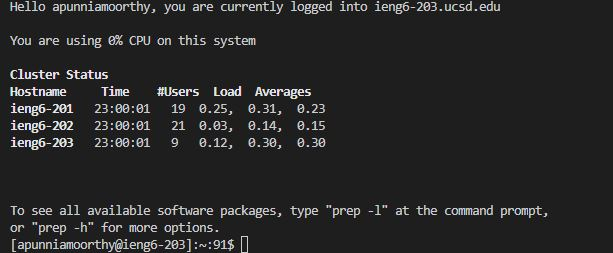

First, make a folder called cse15l-lab1, this will be where we are working. 

Install, VSCode via the website - it is already installed on my system so I cannot show a screenshot.

Open the project in VSCode - I will be right-clicking my lab report file and clicking 'Open with Code'.
![Image][VSCodeOpenProject.jpg]

To remotely connect, open the terminal in VSCode, and the following command: ssh@yourlogin.ieng6.ucsd.edu

It should look like this:

Let's try a command! Let's use different function and see what we get. On separate runs, type 'cd' and 'cd ~' in the terminal. They should look something like this.
![Image][cd.jpg]
